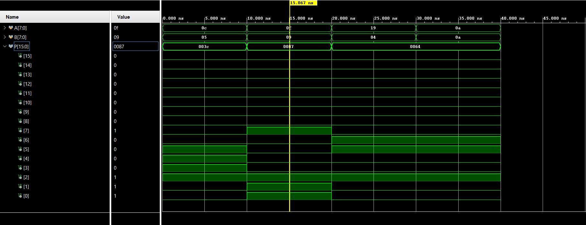

# High-Speed Vedic Multiplier (8×8) Using Verilog

## Overview

This project implements a **high-speed 8×8 multiplier based on Vedic Mathematics** using Verilog Hardware Description Language. The design uses the **Urdhva-Tiryagbhyam (Vertical and Crosswise) algorithm**, which enables parallel generation of partial products and improves computational speed compared to conventional multiplication techniques.

The multiplier is designed and simulated using **AMD Vivado Design Suite**.

---

## Objective

The objective of this project is to design and simulate a **fast digital multiplier** based on Vedic mathematics principles and verify its functionality using hardware description language simulation.

---

## Vedic Multiplication Method

The multiplier uses the **Urdhva-Tiryagbhyam algorithm**, a Vedic mathematics technique that performs multiplication using vertical and crosswise operations.

### Advantages

* Parallel generation of partial products
* Reduced propagation delay
* Higher computational speed
* Efficient hardware implementation

---

## Design Architecture

The 8×8 Vedic multiplier is implemented using a **hierarchical design approach**.

### Structure

* 2×2 Vedic Multiplier
* 4×4 Vedic Multiplier (built using 2×2 blocks)
* 8×8 Vedic Multiplier (built using 4×4 blocks)

### Inputs

* **A[7:0]** – 8-bit input
* **B[7:0]** – 8-bit input

### Output

* **Product[15:0]** – 16-bit multiplication result

---

## Tools Used

* **Verilog HDL**
* **AMD Vivado Design Suite**
* **Behavioral Simulation**

---

## Simulation Waveform

The design is verified using a Verilog testbench in Vivado. Multiple input combinations are applied to ensure correct multiplication results.

### Example Test Cases

| Input A | Input B | Output Product |
| ------- | ------- | -------------- |
| 12      | 5       | 60             |
| 15      | 9       | 135            |
| 25      | 4       | 100            |

The simulation waveform confirms that the multiplier produces the correct results.

---

## Project Files

The repository contains the following files:

* `vedic_2x2.v` – 2×2 Vedic multiplier module
* `vedic_4x4.v` – 4×4 Vedic multiplier module
* `vedic_8x8.v` – Top module implementing the 8×8 multiplier
* `tb_vedic_multiplier.v` – Testbench used for simulation
* `simulation_waveform.png` – Output waveform from Vivado simulation

---

## Applications

Vedic multipliers are widely used in digital systems such as:

* Image processing systems
* High-speed processors
* Embedded systems

---

## Conclusion

This project demonstrates the design and simulation of a **high-speed Vedic multiplier** using Verilog HDL. The **Urdhva-Tiryagbhyam algorithm** enables faster multiplication by generating partial products in parallel, making it suitable for high-performance digital systems.
